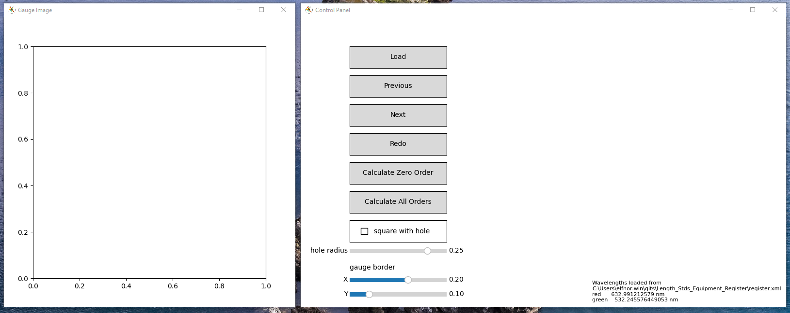
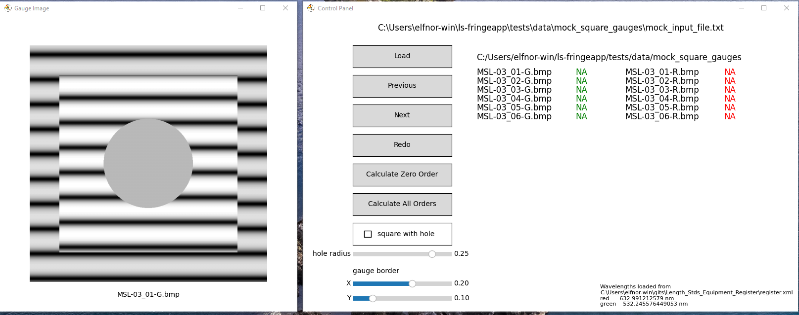
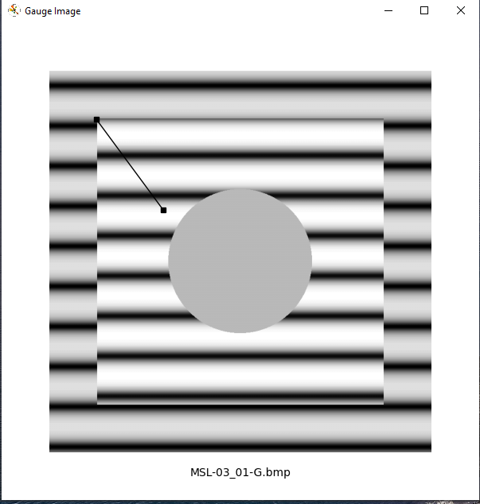
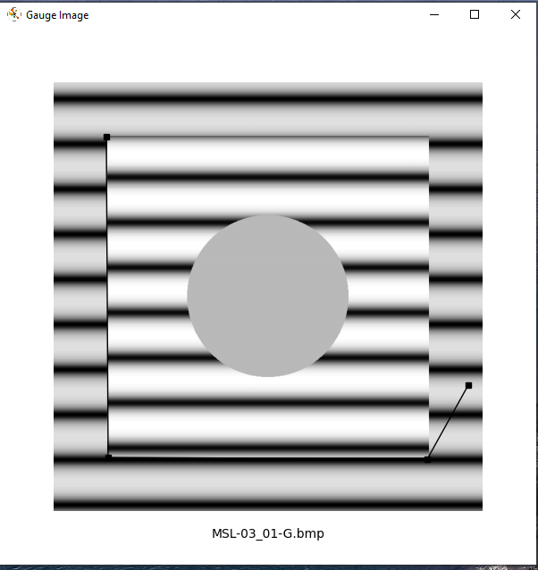
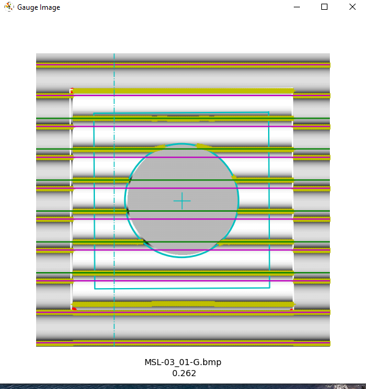

# ls-fringeapp
For processing gauge block fringe images

## Changes 2025-12-15

This is new code that allows analysis of fringe images for square gauges with a central round hole.
The previous code is archived in the `pre-square-gauge-code` branch

## Installation

The recommended method to install and run this code is to use `git` and the `uv` package manager. Instead of git you could download the files directly from GitHub, and/or run from an IDE. Without `uv` getting the right version of python and dependencies is up to you.


### Use git
1. Install git https://git-scm.com/install/windows
2. Set up to work with GitHub and git https://docs.github.com/en/get-started/git-basics/set-up-git
   ```
   git clone https://github.com/MSLNZ/ls-fringeapp.git
   git clone https://github.com/MSLNZ/Length_Stds_Equipment_Register.git
   ```

### Or Just Download from GitHub
1. download the zips file form the "<> Code" button dropdown for both  
   a. https://github.com/MSLNZ/ls-fringeapp  
   b. https://github.com/MSLNZ/Length_Stds_Equipment_Register

2. unzip these to the same folder
   ```
   ├─ ls_fringeApp
   ├─── README.md
   ├───src
   └───ls_fringeapp
   ...
   ├─ Length_Stds_Equipment_Register
   ├─── register.xml

   ```

### Install UV
1. https://docs.astral.sh/uv/getting-started/installation

### RUN 

1. Open a PowerShell window in `ls_fringeapp` folder  
2. `uv run ls_fringeapp`

The first time this is run the correct version of python and the required dependencies will be installed (in a local environment). Use the same command to run again.

If running without `uv` (from an IDE for instance), just run `FringeApp03.py` in the `src/ls_fringeapp` folder. See the end of [progress_notes](progress_notes.md) for more details on file and folder organisation.

## Usage
On startup you'll see the following.


The window on the left will show the gauge images as they are processed. The window on the right is a control panel.

The wavelengths of the lasers used are retrieved from the Length Standards Equipment Register XML file. This will be in the correct relative folder if the above installation process was followed. Otherwise, an error will be shown in the bottom right of the control panel.

Use the "Load" button to open a file written by the [Gauge-Block-File-Writer](https://github.com/MSLNZ/Gauge-Block-File-Writer). The file format is described below.

This will list the images found in the input file and display the first image.



The screenshot shows some mock images found in `tests\data\mock_square_gauges`  

For the square gauges, select `square with hole` and set the hole radius to a little larger than the hole. The slider sets the radius as a proportion of the width of the gauge determined in this next step. You'll probably have to have a couple of attempts to get the right size for the real gauges. Once set it should be the same for all gauges.

The gauge border sliders control an area inside the gauge that is ignored. The sliders again set this as a proportion of the width and height of the gauge. For rectangular gauges the default is 0.1 for the width and 0.2 for the height. For square gauges the default is 0.1 for both. This shouldn't need changing.

In the "Gauge Image" window, use the mouse to click on the top left of the gauge.



Then the bottom left, then the bottom right



Finally right-click anywhere to finish the gauge selection. A right-click before 3 corners are selected is ignored. Extra left-clicks after the first three are also ignored. 

After the right-click the software will analyse the fringe image and annotate it.



Annotations:

- red dots - user mouse clicks
- white rectangle - inner edge of the platen area
- cyan cross - centre of gauge block
- cyan rectangle - outer edge of the gauge area
- cyan circle - mask for central gauge hole - square with hole only
- cyan dot-dash line - starting column for finding gauge fringes
- yellow crosses - peaks of each fringe, 
- pink lines - lines fitted to the peaks of the platen fringes,
- green lines - lines fitted to the peaks of the gauge fringes

The calculated fringe fraction is displayed beneath the image and beside the filename on the control panel. Check visually it looks OK.

If you messed up, click "Redo" in the control panel. Otherwise, click "Next" to work through all the images.

When finished click either "Calculate Zero Order" to calculate the gauge length closest to nominal or "Calculate All Orders" to calculate lengths for 5 fringe orders either side of nominal. Choose the file to save the results to. This will produce a CSV file, with columns as detailed below.

Other output files produced:
 - fflog.txt - a running list of all the attempts at calculating fringe fractions
 - info.shf.db - a binary file storing the annotation data for each image - this will be loaded if available, and annotations shown for previously processed images.


## Input and Output File Formats

This program takes as input a comma separated text file where each 
line represents the data on one gauge wring.

This should have no headers, with the following columns

If both red and green images have been taken:
```
        [
        ("NominalSize", float),
        ("SerialNo", (str, 16)),
        ("RedDateTime", float),
        ("GreenDateTime", float),
        ("SetId", (str, 16)),
        ("PlatenId", int),
        ("Observer", (str, 16)),
        ("Side", int),
        ("ExpCoeff", float),
        ("Units", (str, 16)),
        ("TRAir", float),
        ("TGAir", float),
        ("TR", float),
        ("TG", float),
        ("PR", float),
        ("PG", float),
        ("HR", float),
        ("HG", float),
        ("RedFileName", (str, 256)),
        ("GreenFileName", (str, 256)),]
```
If only red images have been taken
```
    [
        ("NominalSize", float),
        ("SerialNo", (str, 16)),
        ("RedDateTime", float),
        ("SetId", (str, 16)),
        ("PlatenId", int),
        ("Observer", (str, 16)),
        ("Side", int),
        ("ExpCoeff", float),
        ("Units", (str, 16)),
        ("TRAir", float),
        ("TR", float),
        ("PR", float),
        ("HR", float),
        ("RedFileName", (str, 256)),
    ]
 ```   
 It produces a comma separated text file of gauge block measurements 
 where each row represent one gauge block measurement
 
 For red and green images
 ```
    f'{gauge["NominalSize"]:f}',
    f'"{gauge["SerialNo"]:s}"',
    f"{meandev:.1f}",
    f"{diffdev:.1f}",
    f"{rd[idev]:.1f}",
    f"{gd[idev]:.1f}",
    f"{bestindex:d}",
    f'{gauge["RedDateTime"]:f}',
    f'{gauge["GreenDateTime"]:f}',
    f'"{gauge["SetId"]:s}"',
    f'{gauge["PlatenId"]:d}',
    f'{gauge["Side"]:d}',
    f'{gauge["ExpCoeff"]:e}',
    f'"{gauge["Units"]:s}"',
    f'{gauge["TRAir"]:f}',
    f'{gauge["TGAir"]:f}',
    f'{gauge["TR"]:f}',
    f'{gauge["TG"]:f}',
    f'{gauge["PR"]:f}',
    f'{gauge["PG"]:f}',
    f'{gauge["HR"]:f}',
    f'{gauge["HG"]:f}',
    f"{ffred * 100.0:.2f}",
    f"{ffgreen * 100.0:.2f}",
    f"{self.red_wavelength:.7f}",
    f"{self.green_wavelength:.7f}",
    f"{redindex:.8f}"
    f"{greenindex:.8f}"
    f'"{gauge["RedFileName"]:s}"',
    f'"{gauge["GreenFileName"]:s}"',
 ```   
 For red only images
 ```
    f'{gauge["NominalSize"]:f}',
    f'"{gauge["SerialNo"]:s}"',
    f"{rd:.1f}",
    f'{gauge["RedDateTime"]:f}',
    f'"{gauge["SetId"]:s}"',
    f'{gauge["PlatenId"]:d}',
    f'{gauge["Side"]:d}',
    f'{gauge["ExpCoeff"]:e}',
    f'"{gauge["Units"]:s}"',
    f'{gauge["TRAir"]:f}',
    f'{gauge["TR"]:f}',
    f'{gauge["PR"]:f}',
    f'{gauge["HR"]:f}',
    f"{ffred * 100.0:.2f}",
    f"{self.red_wavelength:.7f}",
    f"{redindex:.8f}",
    f'"{gauge["RedFileName"]:s}"',
  ``` 

fflog.txt

A tab separated file of attempts at measuring fringe fractions
columns are
- fringe fraction - 0 to 1
- file name
- user selected gauge corners in pixels
- date stamp

    

 